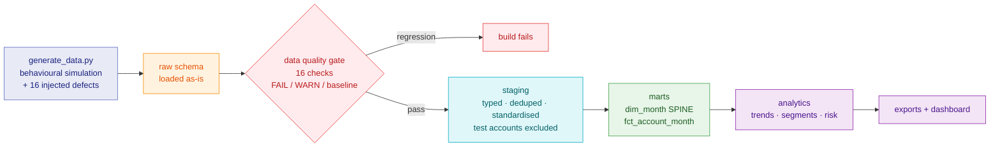

# Customer Usage Analytics Pipeline

A pipeline that joins subscription data with product usage data to find B2B SaaS
customers who are quietly disengaging, before their renewal comes up.

Python and SQL on DuckDB. 36 SQL models run by a small Python runner (no dbt,
see [why](docs/architecture.md)). The data is synthetic: 500 fictional customer
accounts, 24 months, about 3 million usage events, all generated by the repo
itself. `make all` builds everything from scratch in roughly two minutes.

All dollar figures below are simulated. There is no real customer or revenue
data anywhere in this project.

---

## Contents

- [The problem](#the-problem)
- [Architecture](#architecture)
- [Data model](#data-model)
- [Data quality](#data-quality)
- [Findings](#findings)
- [Dashboard](#dashboard)
- [How to run it](#how-to-run-it)
- [Testing](#testing)
- [Repo structure](#repo-structure)
- [Documentation](#documentation)

---

## The problem

Northwind Workspace is a made-up company selling a collaborative workspace
product to about 500 business customers.

The billing system knows who pays. Product analytics knows who clicks. Nobody
has ever joined the two together, so when a customer goes quiet it doesn't get
noticed until someone opens the renewal conversation months later.

This pipeline builds the missing piece: a monthly view of each account's usage
health, flagging zero-usage accounts, sharp drops, sustained declines, adoption
gaps and retention risk.

I wrote the metric definitions before writing any SQL, which mattered more than
I expected it to. They're in
[`docs/business_problem.md`](docs/business_problem.md).

---

## Architecture

```
generate → raw → [quality gate] → staging → marts → analytics → dashboard
```

Five layers. Each one has a job, and more usefully, a list of things it isn't
allowed to do:

| Layer | Job | Not allowed |
|---|---|---|
| **raw** | keep the source exactly as it arrived | any cleaning, casting or filtering |
| **staging** | make it trustworthy | joins, aggregation, business logic |
| **marts** | model the business as facts | opinionated thresholds |
| **analytics** | apply the business rules | re-cleaning data |
| **reporting** | present it | any transformation |

The reason for separating facts from judgements: "412 events in March" will be
true forever, but "this account is high risk" depends on somebody deciding that
30% is the cutoff, and that number will change. Keeping them in different layers
means retuning a threshold is a one-line edit in `config/config.yml` rather than
a rewrite of the thing that counts events.



More on the technology choices and what I traded away in
[`docs/architecture.md`](docs/architecture.md).

---

## Data model

Six source tables:

| Table | One row is | Rows |
|---|---|---|
| `accounts` | a customer company | 507 |
| `users` | a user seat | 19,120 |
| `subscriptions` | one subscription **term** | 1,490 |
| `product_usage_events` | one product event | 2,959,700 |
| `support_tickets` | a support ticket | 6,000 |
| `feature_catalog` | an event type (seed table) | 21 |

The one that carries the project is `marts.fct_account_month`: one row per
account per month, 500 × 24 = 12,000 rows.

It's built from a month spine rather than from the events, and that's the design
decision I'd defend hardest.

If you build monthly usage with `GROUP BY account, month` over the events table,
an account that did nothing in March produces no row at all. So the query meant
to find inactive customers comes back empty, and empty looks like good news.
Generating the full account × month grid first and joining usage onto it turns a
missing row into an explicit zero.

Here that's the difference between finding 767 zero-usage account-months and
finding none.

Full column list, keys, grain statements and the deliberately injected defects
are in [`docs/data_dictionary.md`](docs/data_dictionary.md). ERD:
[`docs/erd.mermaid`](docs/erd.mermaid).

---

## Data quality

16 checks run between raw and staging, one SQL file each, before anything gets
aggregated.

Checks have severities. FAIL stops the build: duplicate keys, orphan foreign
keys, impossible values. WARN gets logged and the build carries on, for things
like a null rate that's above target but survivable.

The more interesting part is baselines. My first run failed nine checks, which
meant the pipeline could never finish. Deleting the checks would have been the
easy fix and the wrong one. A gate that fails on every run is one somebody
eventually turns off. So instead every known defect got a row-count ceiling and
a written note on how staging resolves it, and the gate now catches regression:
it passes on today's known-broken data and fails the moment the data gets worse
than what I'd already signed off on.

Current state: 3 clean, 9 accepted, 4 warnings, 0 regressions. Full report in
[`outputs/dq_report.md`](outputs/dq_report.md).

---

## Findings

Latest reporting month (2026-07), 496 accounts, $9.93M simulated ARR.
Reproducible from a clean clone.

**Test accounts were 10.6% of all usage.** 313,906 of 2,959,700 events came from
three internal demo accounts. Left in, they would have inflated every
company-level metric by more than a tenth and topped every "biggest customers"
list. They get excluded once, in staging, so nothing downstream has to remember
the filter.

Between raw and staging, 327,992 events are dropped in total (11.1%): the test
accounts, 11,791 duplicates, 2,083 events dated before their account existed,
150 with negative quantities, and 25 dated in the future. Every drop is
reconciled and accounted for.

**$1.09M of simulated ARR sits in accounts with zero usage.** 38 accounts paid
and did nothing at all last month. 37 of them have been at zero for three months
or more, so this isn't a quiet month, it's shelfware. This is the finding the
month spine exists to make visible.

**11% of simulated ARR is in the high-risk band**, across 39 accounts.
Enterprise is the most exposed segment:

| Segment | Accounts | High risk | % high risk |
|---|---|---|---|
| Enterprise | 54 | 8 | **14.8%** |
| SMB | 170 | 13 | 7.6% |
| Self-Serve | 175 | 13 | 7.4% |
| Mid-Market | 97 | 5 | 5.2% |

**Dormant and declining accounts get separate lists.** My first pass at the risk
weights put every dormant account in High and left actively-collapsing accounts
in Medium. That ordering is defensible on its own terms: an account at zero for
six months really is worse off than one down 45% with 30 people still logging in.

But it makes the report less useful, because the two groups need opposite
responses. A dormant account needs re-onboarding. A declining one needs somebody
to call this week, while there are still users to save. Rather than tune the
score until the list looked how I wanted it to, the dashboard ships two lists.
77 accounts are declining while still active, and all of them would be invisible
in a single blended ranking.

**Adoption is narrow.** 54 accounts use only one of the six feature areas.
Average seat utilisation among active accounts is 46.2%, so more than half of
paid seats produce nothing in a month. And 52 active accounts have a single user
doing 80% or more of the work, which is key-person risk: one resignation from
going dark, while the headline usage number still looks fine.

**About a quarter of decline signals have a seasonal precedent.** 17 of the 65
accounts flagged on a 3-month trend had a similar dip in the same period a year
earlier. I deliberately didn't auto-correct for that. 24 months isn't enough
history to separate seasonality from a genuine decline with any confidence, so
the pipeline surfaces industry and prior-year comparison and leaves the judgement
to a person. Written up in [`docs/limitations.md`](docs/limitations.md).

---

## Dashboard

[`dashboards/customer_health_dashboard.html`](dashboards/customer_health_dashboard.html)
is a single self-contained file. No server, no build step, just open it in a
browser.

KPI tiles with month-over-month deltas, usage and active-account trends, risk
bands, engagement segments, ARR at risk over time, feature adoption, and the two
action lists. Light and dark themes, hover tooltips, and a table view so nothing
depends on colour alone.

The dashboard itself calculates nothing. Every number on it was computed and
tested upstream. CSV exports for Looker Studio, Power BI or Tableau land in
`outputs/`.

---

## How to run it

```bash
git clone <repo-url> && cd customer-usage-analytics
python -m venv .venv && source .venv/bin/activate    # Windows: .venv\Scripts\activate
pip install -r requirements.txt

make all          # full pipeline, about 2 minutes
```

Individual steps:

```bash
make data         # generate the synthetic source files
make ingest       # load into DuckDB and reconcile row counts
make dq           # 16 quality checks -> outputs/dq_report.md
make marts        # staging + dimensional model, asserts the grain
make analytics    # trends, segments, adoption, risk scoring
make export       # CSV exports and the HTML dashboard
make test         # pytest
```

Every model is `CREATE OR REPLACE`, so re-running is safe and always produces an
identical warehouse. The generator is seeded, so your numbers will match the ones
above.

If you're not comfortable running things from a terminal,
[`docs/RUNBOOK.md`](docs/RUNBOOK.md) goes through every command, what you should
see after each one, and what the common errors actually mean.

---

## Testing

```bash
pytest -q
```

Unit tests cover the rules that are easiest to get subtly wrong, each against a
fixture small enough to verify by hand: the spine producing a row for a
zero-usage month, month-over-month change being suppressed below the volume
floor, the 15-day eligibility boundary, deterministic de-duplication, the
point-in-time overlap join, and impossible values becoming `NULL` rather than
`0`.

Integration tests check the built warehouse itself. That `fct_account_month`
really is one row per account-month. That no test accounts survived staging.
That no pre-signup or future-dated events survived. That country values are
standardised, that no percentage change is reported below the volume floor, and
that every high-risk account has a written reason attached to it.

The grain check also runs inside `make marts` and exits non-zero if it fails, so
a join that fans out stops the build instead of quietly double-counting
everything downstream.

---

## Repo structure

```
├── config/         # every tunable threshold, so there are no magic numbers in code
├── data/           # generated data + the DuckDB warehouse (gitignored)
├── src/            # generation, ingestion, quality checks, build orchestration, exports
├── sql/            # all transformation logic: ingest / staging / marts / analytics / quality
├── tests/          # pytest: metric logic and warehouse invariants
├── outputs/        # quality report and BI exports
├── dashboards/     # the HTML dashboard and its template
└── docs/           # problem, architecture, data dictionary, assumptions, limitations, runbook
```

Generated data isn't committed. The generator is, and it's seeded, so anyone can
reproduce the dataset exactly. Notebooks are for exploring; `src/` and `sql/` are
what actually produce anything.

---

## Documentation

| Doc | What's in it |
|---|---|
| [`business_problem.md`](docs/business_problem.md) | Stakeholders, the decisions this supports, and the metric definitions |
| [`architecture.md`](docs/architecture.md) | Layer design, technology choices and trade-offs |
| [`data_dictionary.md`](docs/data_dictionary.md) | Every table, column, grain, key and injected defect |
| [`assumptions.md`](docs/assumptions.md) | Every judgement call I made |
| [`limitations.md`](docs/limitations.md) | What this project doesn't prove |
| [`RUNBOOK.md`](docs/RUNBOOK.md) | How to run it, from zero |
| [`roadmap.md`](docs/roadmap.md) | Phase-by-phase status |

---

## A note on the data

All of it is synthetic, generated by
[`src/generate_data.py`](src/generate_data.py) from a fixed seed. No proprietary,
employer or customer data appears anywhere in this repository.

Since I wrote the generator, I also wrote the churn behaviour inside it. That is
the reason this project uses explainable rule-based risk flags and makes no claim
of predictive accuracy. A model trained on this data would only be recovering my
own generator rules. More in [`docs/limitations.md`](docs/limitations.md).
